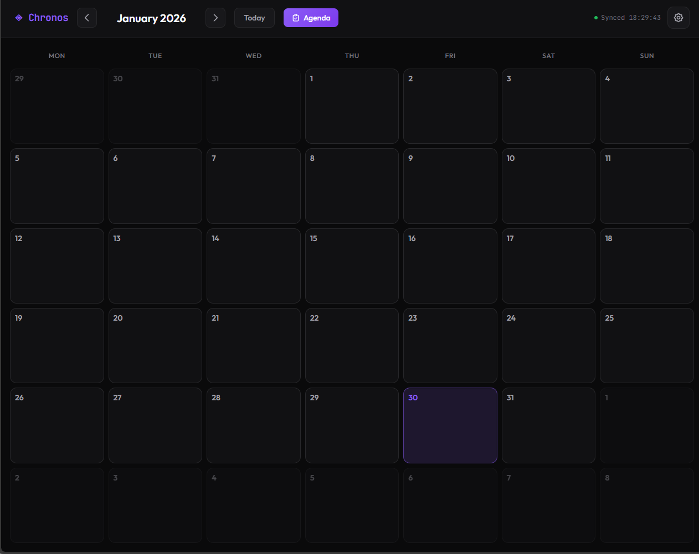
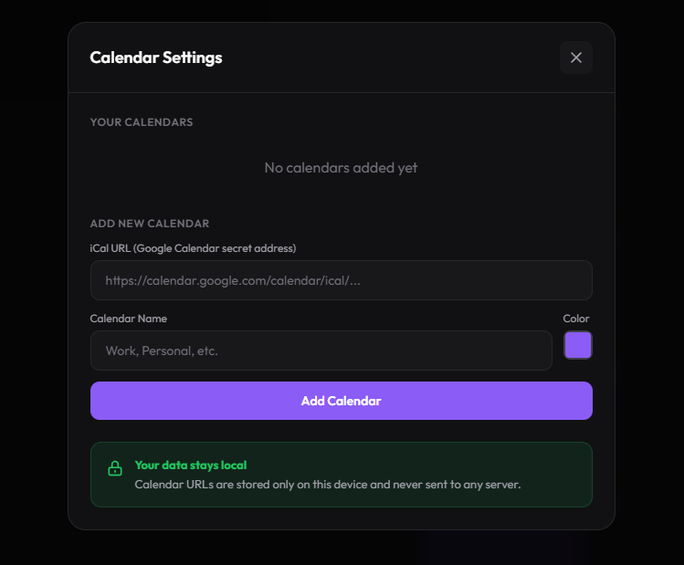

# Chronos Calendar

A clean, local-first calendar app for iPad (and other devices) that syncs with Google Calendar, iCloud, Outlook/Hotmail, or any iCal feed.

**Your data stays on your device.** Calendar URLs are stored locally in your browser—nothing is sent to any server.

---

## Features

- **Month & Week views** — toggle between views, swipe to navigate
- **Event search** — quickly find any event by name
- **Morning briefing** — pops up at 07:00 with your day's agenda
- **Customizable reminders** — 15min, 30min, 1hr, or 2hrs before events
- **Multiple calendars** — custom names, colors, and visibility toggles
- **Tap any day** to see full event list, tap an event for details
- **Works offline** after initial setup (syncs when online)
- **Dark mode** — easy on the eyes

---

## Installation (iPad)

### Step 1: Open in Safari
Go to: **[https://ezekielnor.github.io/Chronos-Calendar/](https://ezekielnor.github.io/Chronos-Calendar/)**

> ⚠️ Must use Safari—won't work from Files app or other browsers.

### Step 2: Add to Home Screen

1. Tap the **Share button** (square with arrow pointing up)
2. Scroll down and tap **"Add to Home Screen"**
3. Name it whatever you like, tap **Add**

### Step 3: Open from Home Screen
Launch Chronos from your home screen. It now runs as a standalone app—no browser bars, works offline.

---

## Getting Your Calendar URL

Chronos needs an iCal URL to read your calendar. Here's how to get it for each provider:

### 📅 Google Calendar

1. Open [Google Calendar](https://calendar.google.com) on a **computer**
2. Click the **⚙️ gear icon** (top right) → **Settings**
3. In the left sidebar, click the calendar you want to share
4. Scroll down to **"Integrate calendar"** section
5. Find **"Secret address in iCal format"**
6. Copy the URL (starts with `https://calendar.google.com/calendar/ical/...`)

> 💡 Use the **Secret address**, not the Public address—it works without making your calendar publicly searchable.

---

### 🍎 Apple iCloud Calendar

#### Option A: From iCloud.com (easiest)
1. Go to [icloud.com/calendar](https://www.icloud.com/calendar) and sign in
2. In the left sidebar, click the **share icon** (person or signal icon) next to your calendar
3. Toggle **"Public Calendar"** ON
4. Click **"Copy Link"**
5. The URL starts with `webcal://` — this works in Chronos

#### Option B: From Mac Calendar app
1. Open the **Calendar** app
2. Right-click (or Control-click) the calendar you want to share
3. Select **"Share Calendar..."**
4. Check **"Public Calendar"**
5. Click the **"Share Calendar"** button again to copy the link

#### Option C: From iPhone/iPad Calendar app
1. Open **Calendar** app
2. Tap **"Calendars"** at the bottom
3. Tap the **ⓘ info icon** next to the calendar you want
4. Toggle **"Public Calendar"** ON
5. Tap **"Share Link"** and copy it

> ⚠️ Note: iCloud's "Public Calendar" just means it has a URL—only people you share the link with can see it.

---

### 📧 Outlook / Hotmail / Microsoft 365

1. Go to [outlook.live.com/calendar](https://outlook.live.com/calendar) (or your Microsoft 365 calendar)
2. Click the **⚙️ Settings gear** (top right)
3. Click **"View all Outlook settings"** at the bottom
4. Go to **Calendar** → **Shared calendars**
5. Under **"Publish a calendar"**:
   - Select your calendar from the dropdown
   - Choose **"Can view all details"** for permissions
   - Click **"Publish"**
6. Copy the **ICS link** (not the HTML link)

> 💡 The ICS link looks like: `https://outlook.live.com/owa/calendar/.../calendar.ics`

---

## Adding Calendars to Chronos

Once you have your iCal URL:

1. Open Chronos and tap the **⚙️ Settings** button (top right)
2. Paste the URL in the **iCal URL** field
3. Give it a name (e.g., "Work", "Family", "Kids")
4. Pick a color
5. Tap **Add Calendar**

Repeat for each calendar. They'll all show up color-coded in your view.

---

## How It Works

| Feature | Description |
|---------|-------------|
| **Month/Week toggle** | Switch views with the toggle buttons |
| **Swipe navigation** | Swipe left/right to change weeks or months |
| **Search** | Tap 🔍 to search events by name |
| **Auto-sync** | Fetches updates every 60 seconds |
| **Morning briefing** | Shows today's events at 07:00 (or tap "Agenda" anytime) |
| **Event reminders** | Popup + sound at your chosen time before events |
| **Calendar toggle** | Show/hide calendars without deleting them |
| **Day view** | Tap any day to see all events |
| **Event details** | Tap an event for full info (time, location, description) |

---

## Tips

- **Enable notifications** when prompted—needed for reminders to work
- **Multiple family members?** Each person sets up their own calendars on their own device. Nothing is shared between devices.
- **Shared family calendar?** Everyone adds the same calendar URL on their own device
- **Hide a calendar temporarily?** Use the toggle switch in Settings instead of deleting
- **Customize reminder time** in Settings (15min to 2 hours)

---

## Privacy

🔒 **100% local storage**

- Calendar URLs stored only in your browser
- No accounts, no servers, no tracking
- Each device is completely independent
- We use a CORS proxy to fetch calendars (required by browsers), but your URLs are not logged or stored

---

## Troubleshooting

**App won't open / buttons don't work:**
- Make sure you're opening from Home Screen, not Safari
- Try removing and re-adding to Home Screen

**Calendar not showing events:**
- Double-check the iCal URL is correct
- Make sure the calendar has events in the current month
- Check the calendar toggle is enabled in Settings
- For iCloud: ensure "Public Calendar" is still toggled ON

**No notifications:**
- Tap "Enable" on the notification banner
- Check iPad Settings → Safari → Notifications

**Google Calendar: "Secret address" not showing:**
- Your Google Workspace admin may have disabled this
- Ask them to enable it in Admin Console → Apps → Google Workspace → Calendar → Sharing settings

---

## Credits

Created by **Ezekiel Hauge**  
[Eztheory AS](https://eztheory.no) · [GitHub](https://github.com/EzekielNOR/Chronos-Calendar)

---

Questions or issues? Open an issue or reach out!